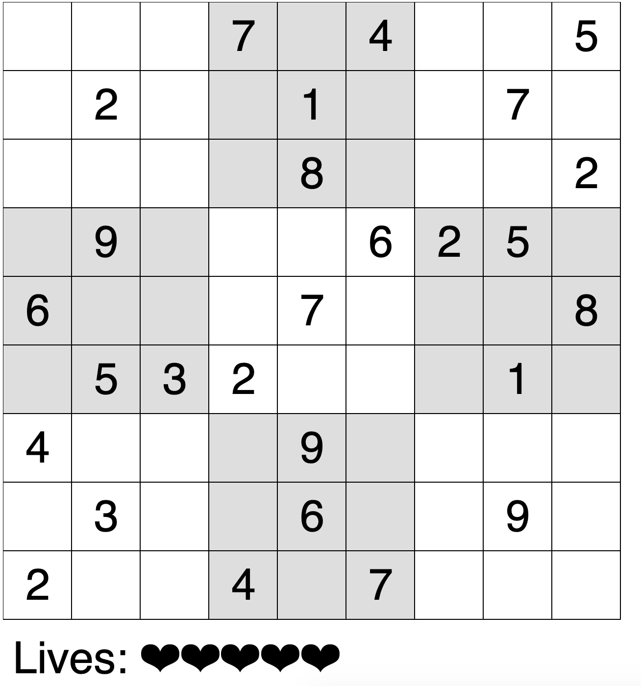
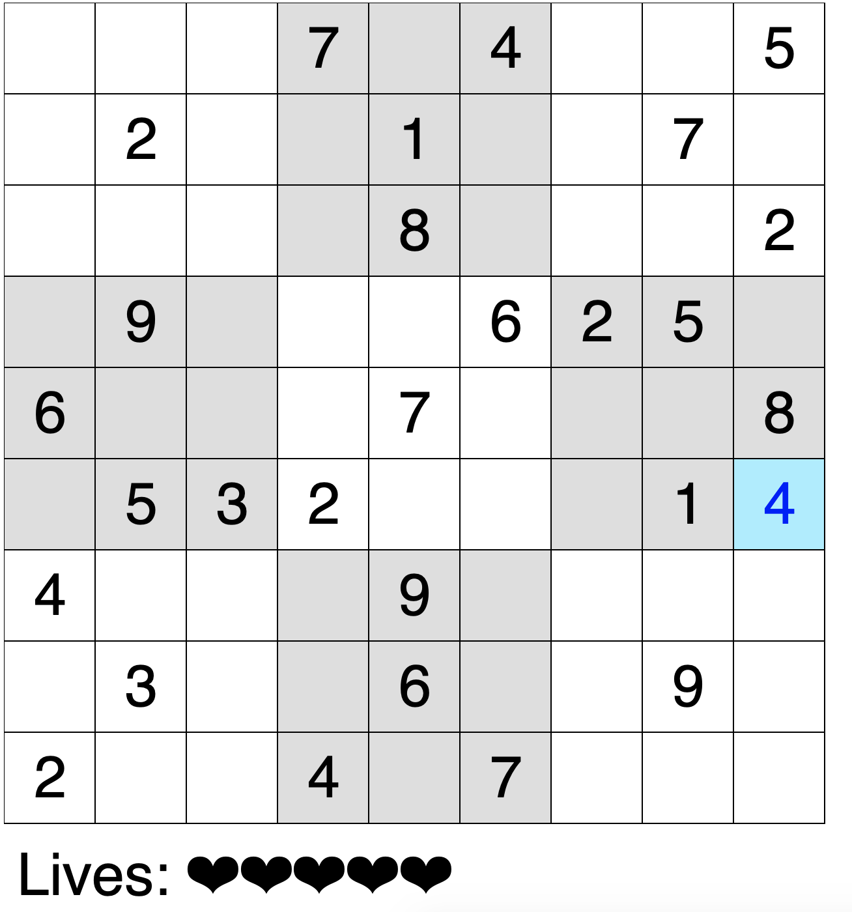

# Sudoku Game  

Sudoku game made with Javascript using the [p5.js](https://p5js.org) library.  
You can play the game [here](https://facundospira.github.io/Sudoku-Game/)

## Instructions  
In order to play select an empty cell and write down the number that you wish to add. You will notice that it appears in blue. To confirm the change press ENTER. If it was right the number will be written, otherwise you will lose a life.

## Screenshots

